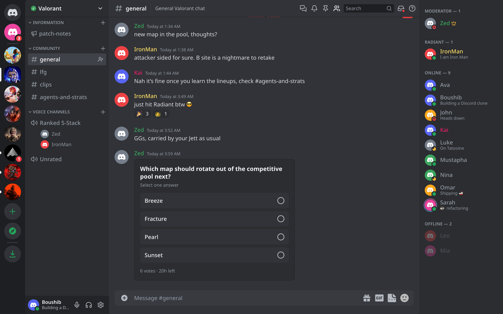
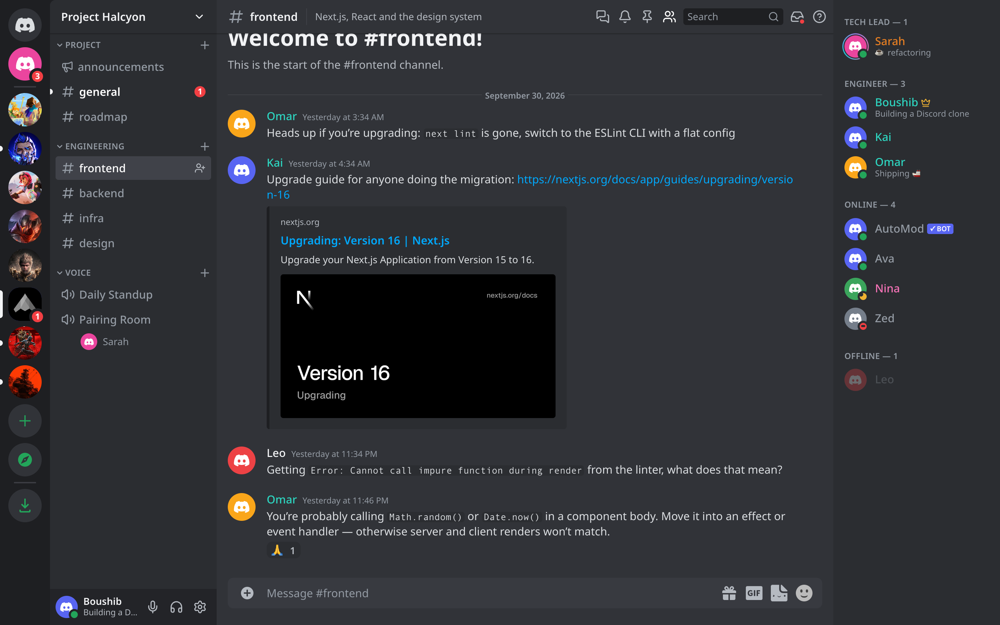
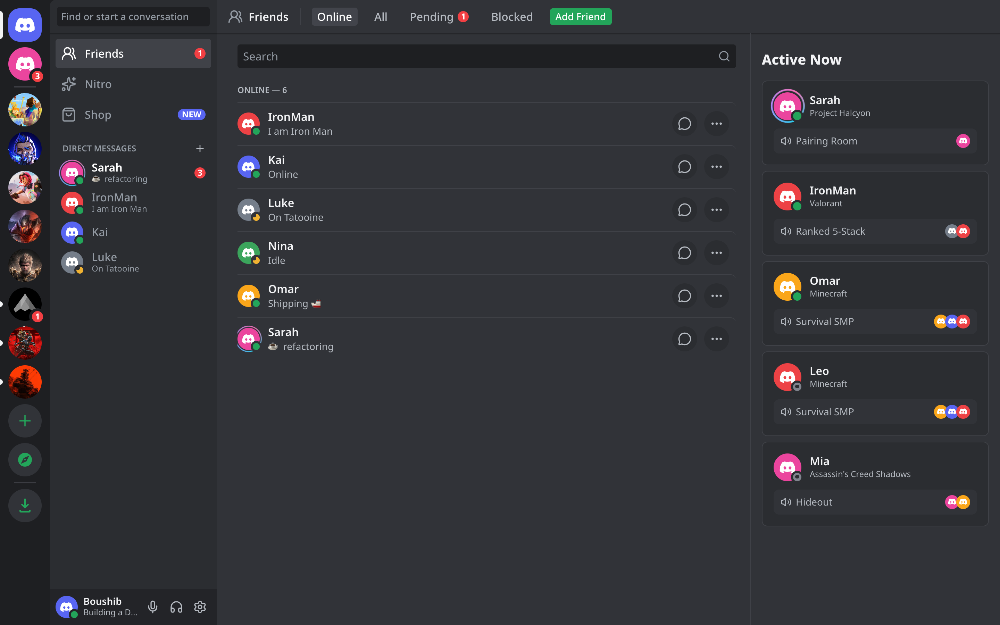

<div align="center">

# 💬 Discord 3.0

**A Discord clone with servers, voice and video, threads, polls and link previews.**

[](https://nextjs.org)
[](https://react.dev)
[](https://www.typescriptlang.org)
[](https://redux-toolkit.js.org)
[](https://sass-lang.com)
[](LICENSE)
<br />
[](https://github.com/boushib/discord-clone-3.0/commits/main)
[](https://github.com/boushib/discord-clone-3.0)
[](https://github.com/boushib/discord-clone-3.0)



</div>

## Screenshots

**Link previews:** rich embeds for any URL, built by a Next.js route handler



**Friends:** online friends, direct messages and Active Now



## About

A Discord clone built with **Next.js 16** (App Router), **React 19** and **Redux Toolkit**. The app runs in the browser: all data lives in a Redux store saved to `localStorage`, and other users are simulated, so they type, reply, react, vote and claim gifts. The only server-side piece is a route handler that builds link previews.

## Features

### Servers & channels
- Demo servers for **Minecraft, Valorant, Fortnite, League of Legends, Black Myth: Wukong, Assassin's Creed Shadows, Battlefield 6** and **Project Halcyon** (a stealth tech project team you own)
- Server rail with unread pills, mention badges, tooltips, drag-to-reorder and **server folders** (drag a server onto another; rename/recolor/ungroup from the right-click menu)
- Create servers from scratch or a template, join communities from the **Discovery** page, invite friends (DM or copy a link), leave
- **Server settings** for owners: name, icon, banner, **roles** (color, rank, hoisted section), **members** (assign roles, kick), **custom emoji and stickers**, delete server
- Collapsible categories; text, announcement and voice channels; create, rename and delete channels and set topics
- Per-channel **mute and notification levels** (all messages, only @mentions, nothing)
- **Threads** started from any message, opened in a side panel and listed under their channel

### Messaging
- Markdown: bold, italic, underline, strike, inline code, **syntax-highlighted code blocks** (```` ```tsx ````, ```` ```py ````, … with a copy button), spoilers, quotes, headings, lists, links and @mentions
- Grouped messages, date dividers, a "NEW" line at the first message that was unread when you opened the channel
- Reactions (including custom emoji), replies, inline editing, pins, delete (Shift+click skips the confirmation), mark unread
- **Save for Later** bookmarks and **message forwarding** to up to five DMs or channels with an optional note
- Composer autocomplete for `@mentions`, `:emoji:` (custom server emoji too) and `/commands` (`/shrug`, `/tableflip`, `/unflip`, `/me`, `/spoiler`)
- File uploads by picker, paste or drag-and-drop; GIFs, stickers (built-in and custom), **polls** and Nitro gifts
- **Custom server emoji**: `:name:` becomes a `<:name:id>` token and renders as an image anywhere; emoji-only messages render large
- **Rich link previews** for any URL (title, description, image, site name), YouTube links as playable embeds, image links shown inline
- Typing indicators, simulated replies, and a "Jump To Present" bar when you've scrolled up

### Voice & video
- Voice channels with a call view: participant tiles, speaking indicators, spotlight, camera/screen/mute/disconnect controls
- Your **camera** (`getUserMedia`), **screen share** (`getDisplayMedia`) and **microphone level** (Web Audio, lights your speaking ring) are real; other participants are simulated
- One-to-one voice and video calls in DMs; the call keeps running while you browse

### Social
- Friends page: online, all, pending and blocked; add friends by username; Active Now
- DMs and **group DMs** (renamable, with a member list), profile cards, custom status
- Presence (online, idle, do not disturb, invisible) with **auto-idle** after 10 minutes away
- Member list grouped by hoisted roles with role colors and an owner crown

### Everything else
- Server-wide **search** with `from:`, `in:`, `has:link|image|file|video|poll|sticker`, `mentions:` and `pinned:true` filters
- **Inbox** with your @mentions, unread channels and saved messages; pinned messages per channel
- **Notification sounds** and desktop notifications for DMs and @mentions (Do Not Disturb silences them)
- Ctrl/⌘+K quick switcher, Ctrl/⌘+/ keyboard shortcuts, Ctrl/⌘+Shift+M/D to mute/deafen
- User settings: profile editor with live preview, account details, **dark/light theme**, cozy/compact display, notification preferences, reset demo data
- Nitro and Shop demo pages (avatar decorations)
- Mobile layout with a navigation drawer

## Getting started

Requires Node.js 20.9+ and pnpm.

```bash
pnpm install
pnpm dev
```

Open [http://localhost:3000](http://localhost:3000). To start over with fresh demo data, go to **User Settings → Reset Demo Data**. Saved data from older versions is migrated automatically when the demo servers change.

| Script | What it does |
| --- | --- |
| `pnpm dev` | Dev server with Turbopack |
| `pnpm build` / `pnpm start` | Production build and server |
| `pnpm lint` | ESLint (flat config) |
| `pnpm typecheck` | TypeScript, no emit |
| `pnpm dev:agent` / `pnpm build:agent` | Same as dev/build on port 3100 with a separate `.next-agent` output, so a second server doesn't clash with yours |

## API

### `GET /api/unfurl?url=<url>`

Returns a link preview for a public web page:

```json
{ "url": "…", "siteName": "GitHub", "title": "…", "description": "…", "image": "https://…", "themeColor": "#1e2327" }
```

The fetch is hardened against SSRF: only `http(s)` on default ports, the hostname must resolve to public addresses (checked again on every redirect), a 5 second timeout and a 512 KB read limit. Results are cached in memory for an hour. Unreachable or blocked URLs return an error status and the client shows no preview.

## Project structure

```
app/                                Routes (App Router)
  api/unfurl/route.ts               Link preview route handler
  channels/[serverId]/[channelId]   Channel, DM, Nitro and Shop pages
  channels/discovery                Discovery page
components/                         UI, one folder per component, with Sass modules
constants/                          Seed data, emoji, GIFs, stickers, shop items, custom expressions
store/                              Redux slices, selectors, persistence/migrations, reply simulation
lib/                                Formatting, routes, files, search, syntax highlighting, custom emoji
lib/server/                         Server-only code (SSRF-safe fetch, HTML meta parsing)
public/servers/                     Server icon artwork
```

- `/channels/@me` is Home (Friends and DMs). `@me` goes through the dynamic `[serverId]` segment because a folder starting with `@` would be a parallel route slot.
- The UI renders only on the client (after a Discord-style loading screen), because every piece of data comes from `localStorage`.
- Media streams live in a React context above the router, so a call keeps going while you browse other channels.
- `store/persist.ts` versions the demo data (`SEED_VERSION`) and migrates saved state: retired servers are swapped for new ones while user-created servers, DMs and settings are kept.

## Roadmap

Planned features, roughly in order of impact.

### Without a backend
- **Forum channels:** a channel of topic cards with tags, sorting and a "New Post" composer; each post opens as a thread.
- **Scheduled events:** "Events" at the top of the channel list with RSVP, a countdown and a "Live now" banner when an event starts in a voice channel.
- **Soundboard:** a panel of short sounds in voice channels, synthesized or uploaded per server.
- **Invite links:** an `/invite/[code]` page ("You've been invited to join…") with Accept, wired to the existing invite modal.
- **More Discord message syntax:** timestamps (`<t:1735689600:R>` → "in 3 days"), masked links (`[text](url)`), `-# subtext`, and `@silent` messages that don't notify.
- **Moderation:** channel slow mode, a basic AutoMod keyword filter, and an audit log in Server Settings.
- **Voice settings:** push-to-talk, input/output device selection and an input volume meter.

### Needs a backend
- **Real multi-user chat:** accounts and sign-in, a database for servers/channels/messages, and live updates over WebSockets (or a hosted realtime service) instead of `localStorage`.
- **Real voice, video and screen sharing between people:** WebRTC signaling plus a media server (e.g. LiveKit) so streams reach other participants.
- **Uploads and emoji in object storage** instead of data URLs, with size limits enforced server-side.
- **Push notifications** and unread state synced across devices.
- Decisions needed first: hosting, database, and the sign-in method.

## License

[MIT](LICENSE) © El Hassane Boushib
